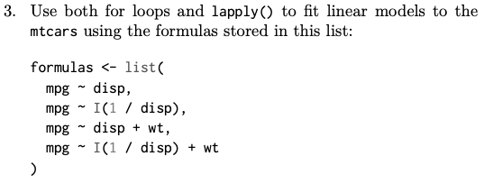
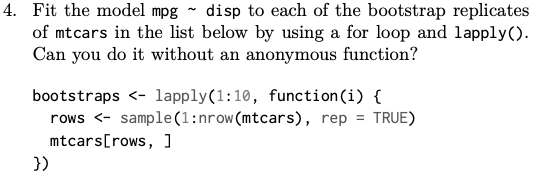
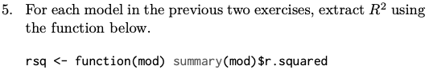
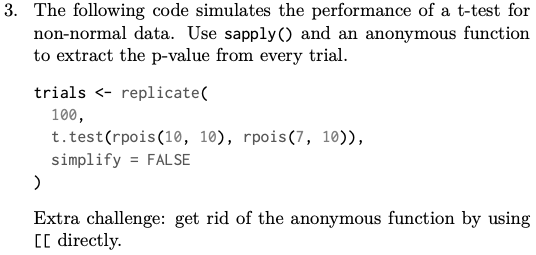
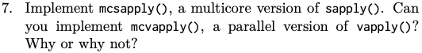

## question 1


```{r,include=TRUE}
library(datasets)
attach(mtcars)
formulas <- list(
mpg ~ disp,
mpg ~ I(1 / disp), 
mpg~disp+wt, 
mpg~I(1/disp)+wt
)

l1 <- list()
system.time(for(i in seq_along(formulas)){
  l1[[i]] <- lm(formulas[[i]])
})

system.time(l2 <- lapply(formulas,lm))
l1
l2
detach(mtcars)

```

From the results, we can find that the linear models using the two functions are the same, but they takes different time.

## question 2


```{r,include=TRUE}
attach(mtcars)
bootstraps <- lapply(1:10, function(i) {
  rows <- sample(1:nrow(mtcars), rep = TRUE) 
  mtcars[rows, ]
})

l3 <- list()
for(i in seq_along(bootstraps)){
  l3[[i]] <- lm(mpg ~ disp, data = bootstraps[[i]])
}

l4 <- lapply(bootstraps,function(x){lm(mpg~disp,data=x)})
l3
l4

#g <- function(formula,data) lm(formula,data)
#l5 <- vpply(1:10, g, formula=as.formula(mpg~disp))
detach(mtcars)
```

Here, when using **lapply()**, the anonymous function is necessary.

## question 3


```{r,include=TRUE}
rsq <- function(mod) summary(mod)$r.squared
rsq1 <- unlist(lapply(l1,rsq))
rsq2 <- unlist(lapply(l2,rsq))
rsq3 <- unlist(lapply(l3,rsq))
rsq4 <- unlist(lapply(l4,rsq))
knitr::kable(rbind(rsq1,rsq2),caption = "comparison of l1 and l2 in question 1")
knitr::kable(rbind(rsq3,rsq4),caption = "comparison of l3 and l4 in question 2")

```

## qustion 4


```{r,include=TRUE}
trials <- replicate( 100,
t.test(rpois(10, 10), rpois(7, 10)),
         simplify = FALSE
       )
re <- sapply(trials,function(x){x$p.value})
par(mfrow=c(1,2))
boxplot(re,type="p",xlab = "p-value of 100 replicates")

f <- function(trials,i) trials[[i]]$p.value
re1 <- sapply(1:100,f,trials=trials)
boxplot(re1,type="p",xlab = "p-value of 100 replicates without anonymous function")
par(mfrow=c(1,1))
```

## question 5

```{r,eval=FALSE}
library(parallel)

# the implementation of sapply() in R
sapply <- function (X, FUN, ..., simplify = TRUE, USE.NAMES = TRUE) 
{
    FUN <- match.fun(FUN)
    answer <- lapply(X = X, FUN = FUN, ...)
    if (USE.NAMES && is.character(X) && is.null(names(answer))) 
        names(answer) <- X
    if (!isFALSE(simplify) && length(answer)) 
        simplify2array(answer, higher = (simplify == "array"))
    else answer
}

# An mc-version of the sapply function based on the implementation of sapply()
# just replace lapply() with mclapply()
mcsapply <- function (X, FUN, ..., simplify = TRUE, USE.NAMES = TRUE) {
  FUN <- match.fun(FUN)
  answer <- parallel::mclapply(X = X, FUN = FUN, ...)
  if (USE.NAMES && is.character(X) && is.null(names(answer))) 
    names(answer) <- X
  if (!isFALSE(simplify) && length(answer)) 
    simplify2array(answer, higher = (simplify == "array"))
  else answer
}

# Testing for the inplementation of mcsapply
system.time(ans0 <- mcsapply(1:20, function(i) rnorm(1e4), mc.cores = 4))
system.time(ans1 <- sapply(1:20, function(i) rnorm(1e4)))

# the implementation of vapply() in R
vapply <- function (X, FUN, FUN.VALUE, ..., USE.NAMES = TRUE) 
{
    FUN <- match.fun(FUN)
    if (!is.vector(X) || is.object(X)) 
        X <- as.list(X)
    .Internal(vapply(X, FUN, FUN.VALUE, USE.NAMES))
}

```

here, we can't implement mcvapply, because the base of **vapply()** doesn't contain the **lapply**, we can't make the similar replacement like **mcsapply()**.


